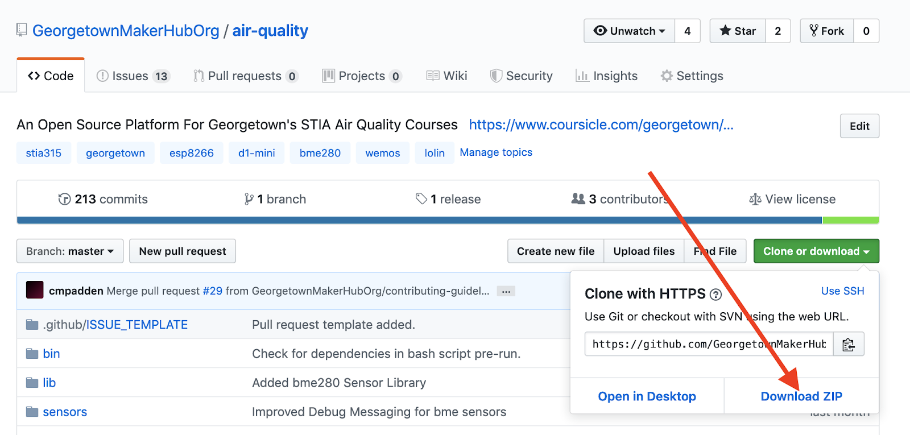
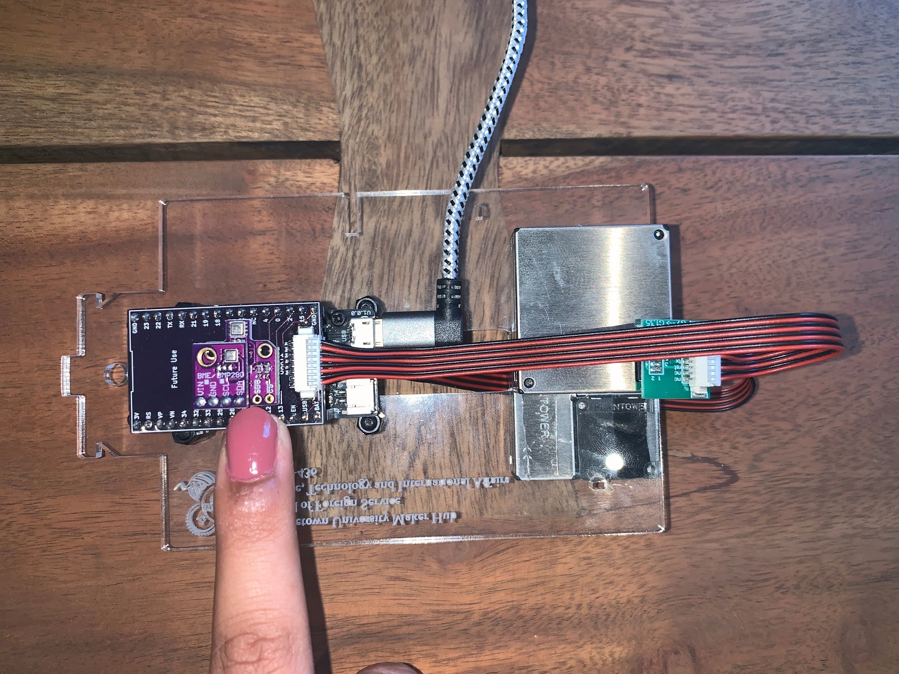
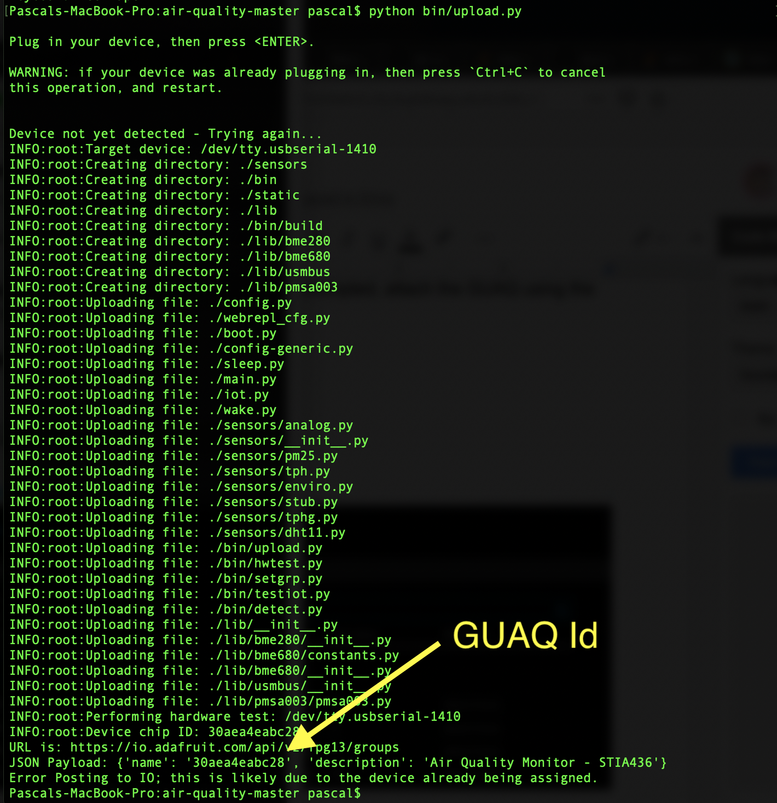
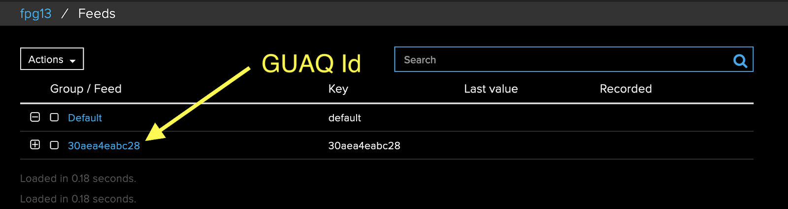

# Instructions

## Version 905 Upgrade Instructions

### Prerequisites

**Supported Operating Systems.**  At present, the upgrade supports only Mac OS
X (10.12 or higher) and Linux operating systems. This tool has been tested with
Python 2 and 3 on Mac OS X 10.14, Raspian Buster 10, and GalliumOS 2.1 systems.
Some familiarity with using the command line interface (CLI) of these operating
systems is required.

**Internet Access.** The GUAQ application is hosted on Georgetown University’s
[GitHub repository](https://github.com/GeorgetownMakerHubOrg). Access to this
software distribution as well as other git repositories prior to upgrade is
required. The actual upgrade process will require internet access as it will
create the IoT group on [Adafruit I/O](https://io.adafruit.com) for the GUAQ
monitor.

**USB Cable.**  Some USB cables supply only power.  Please use the supplied USB
cable which provides both power and data connections to the GUAQ monitor.

**Additional Tools and Utilities.** The upgrade tool requires `pip` (Python
package manager) `screen` (serial interface tool), and `ampy` (file transfer
tool).  Details for installing these packages are provided below.

**Upgrade mode.** The GUAQ must be in upgrade mode for this procedure. To enter
upgrade mode, remove the base unit from the Stevenson screen enclosure.

### Upgrade Process

There are 6 basic steps. Individuals new to the upgrade process should schedule
2 hours for the entire procedure:

1. Download the GUAQ Distribution _(10 minutes)_
1. Extract the GUAQ Software _(5 minutes)_
1. Configure GUAQ For The Local Site _(1 hour)_
1. Install Necessary Tools _(10 minutes)_
1. Upgrade GUAQ monitor _(10 minutes)_
1. Confirm GUAQ Functionality _(5 minutes)_

#### Download the GUAQ Distribution _(10 minutes)_

Using a web browser, visit the [GUAQ
repository](https://github.com/GeorgetownMakerHubOrg/air-quality). Download the
GUAQ file using the


button on the right side of the page. Use the `Download Zip` button (see red
arrow) to save it to a directory of your choice (e.g.  /Users/guaqteam/guaq).



#### Extract the GUAQ Software _(5 minutes)_

Open the Terminal application located under the Mac OS X Utilities. For Linux
users, open a terminal window. Change the current working directory to where
**air-quality-master.zip** resides and run `unzip air-quality-master.zip`:

```
MacBook:~ guaqteam$ cd
MacBook:~ guaqteam$ pwd
/Users/guaqteam
MacBook:~ guaqteam$ ls -l
total 3640
-rw-r--r--@ 1 guaqteam  staff  1862164 Aug 12 17:45 air-quality-master.zip
MacBook:~ guaqteam$ unzip air-quality-master.zip
```

#### Configure GUAQ For The Site (1 hour)

The GUAQ distribution includes a generic configuration (`config-generic.py`)
file that needs modification to accommodate site specific parameters. These
include, among others, the GUAQ geolocation and Wifi credentials.

```
# Geolocation information
# Default on Carroll's statue: lat=38.907606, lon=-77.072257
LATITUDE = 38.907606
LONGITUDE = -77.072257

# Wifi Parameters
STA_SSID = "GuestNet"
STA_PASSWORD = "GoHoyaSaxa"
AP_SSID = "STIA436-fpg"  # use an SSID that combines class and GUID to make it
unique.
AP_PASSWORD = "HillTopHoyas"

# Adafruit
X_AIO_KEY = "Io.Adafruit.X_AIO_KEY025ea3251b199c42f4520"
USER = "IO-ADAFRUIT-USER-NAME"
GROUP = "Adafruit-Group-Name"

# ThingSpeak - Write API Key
TS_KEY = "THINGSPEAKWRITEKEY"

# Sleep time for wake/sleep cycle in milliseconds
SLEEP = 60 * 1000

# Capacitive Touch Parameters
TOUCH_PIN = 13
TOUCH_THRESHOLD = 100

# Enable Debugging Statements
DEBUG = True
```

Copy this file to `config.py` and use `nano`, `vi`, or preferred text editor to
modify the above parameters in config.py. The GUAQ team will supply the
Adafruit __X_AIO_KEY__, __USER__ and __GROUP__ values:

```
MacBook:air-quality-master guaqteam$ cp config-generic.py config.py
MacBook:air-quality-master guaqteam$ nano config.py
```

#### Install Ampy, and Pip Utilities _(10 minutes)_

On Mac OS X, `pip` is not installed by default. To install it on OS X, use:

```
MacBook:air-quality-master guaqteam$ sudo easy_install pip
Password: ********
Searching for pip
Best match: pip 18.0
Adding pip 18.0 to easy-install.pth file
Installing pip script to /anaconda3/bin
Installing pip3 script to /anaconda3/bin
Installing pip3.7 script to /anaconda3/bin

Using /anaconda3/lib/python3.6/site-packages
Processing dependencies for pip
Finished processing dependencies for pip
```

Follow [Adafruit’s instructions](https://github.com/pycampers/ampy) to install
ampy. Briefly, for Python2 on the Mac, it’s:

```
MacBook:air-quality-master guaqteam$ sudo pip install adafruit-ampy
```

__Optional:__ The GUAQ git repository and accompanying `upload.py` tool also
supports a full restore (re-installation) of the latest, stable MicroPython
interpreter (1.11). If it becomes necessary to reset the GUAQ, the esptool.py
will need to be installed. Instructions for installing esptool.py can be found
[here](https://github.com/espressif/esptool). For Python2 on the Mac, the
command should be:

```
MacBook:air-quality-master guaqteam$ pip install esptool
```

#### Upgrade GUAQ _(10 minutes)_

While the GUAQ team has developed a web-based, network file transfer tool, this
capability has not been fully tested and documented. For the current release, a
USB serial file transfer is required.

Upgrade mode is enabled by sensing touch on Pin 13 of the GUAQ processor.
Placing a finger on Pin 13 of the shield for 10 seconds while attaching GUAQ to
the laptop/computer will put GUAQ into upgrade mode.



Run the following `python bin/upload.py` and when prompted, attach the GUAQ
using the above upgrade technique.

The following output (note the GUAQ Id) is expected:



#### Confirm GUAQ Functionality _(5 minutes)_

If the upgrade is successful and communicating with the Adafruit IoT service,
data will post at !(https://io.adafruit.com/fpg13/feeds). The GUAQ team will
provide the username and password to access this account.



GUAQ also has a console that is accessible over the serial interface. The
`screen` utility is the best tool for this purpose, however, Raspian and
GalliumOS do not include the `screen` utility by default. To add this tool, use
the linux update tool `apt-get`:

```
GalliumOS:air-quality-master guaqteam$ sudo apt-get install screen
```

Next, identify the serial port attached to GUAQ. The default serial names for
each operating system are:

OS             | Device                      | Example
-------------- | --------------------------- | -----------------------
Mac OS X 10.4  | /dev/tty.usbserial-<number> | /dev/tty.usbserial-1410
Raspian Buster | /dev/ttyUSB<number>         | /dev/ttyUSB0
GalliumOS      | /dev/ttyUSB<number>         | /dev/ttyUSB0

From a terminal, use the `ls` command to locate the serial port that’s in use.
On Mac OS X, this command would be:

```
MacBook:air-quality~ guaqteam$
MacBook:air-quality~ guaqteam$ ls -l /dev/tty.usb*
crw-rw-rw-  1 root  wheel   18,  24 Aug 13 10:40 /dev/tty.usbserial-1410
MacBook-Pro:air-quality~ guaqteam$
```

Using this serial port, launch:

```
MacBook:~ guaqteam$ screen /dev/tty.usbserial-1410 115200
```

To exit `screen`, the sequence `Ctrl-A` then the letter `K` will end the
session.  Keep in mind that the GUAQ might be in deep-sleep when the connection
is made so don’t expect immediate console output!

#### Complete!

Congratulations, you have made it through the GUAQ upgrade process!
